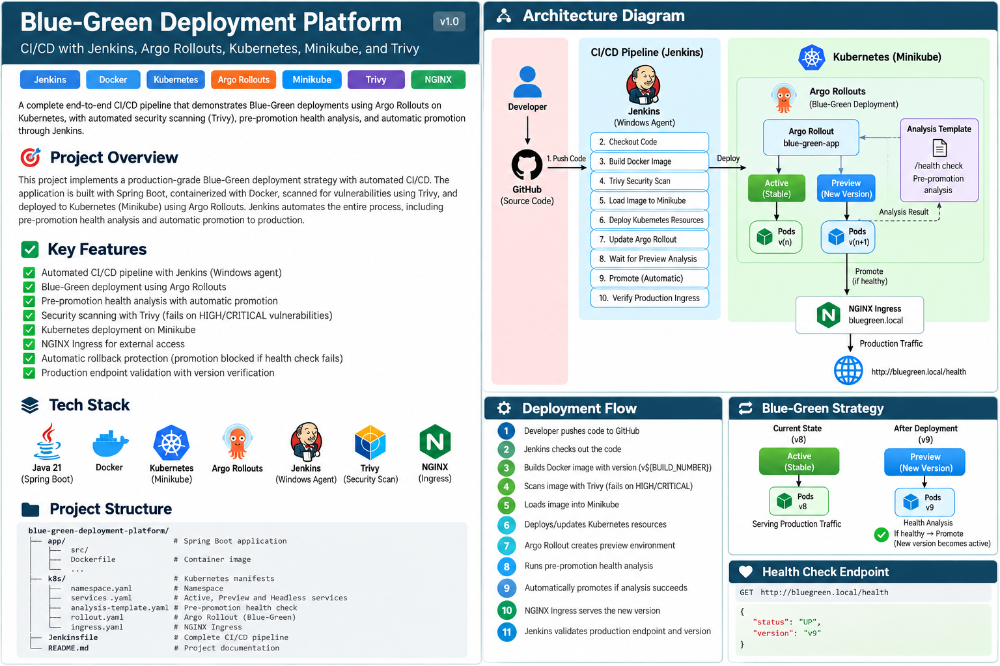

# Blue-Green Deployment Platform

End-to-end DevOps project demonstrating **Blue-Green deployments on Kubernetes using Argo Rollouts**, with Jenkins CI/CD, Docker, Trivy security scanning, NGINX Ingress, and Minikube.



## Overview

This project implements a production-style Blue-Green deployment workflow. A new application version is deployed alongside the currently active version in a preview environment. Argo Rollouts performs pre-promotion health analysis; when validation succeeds, Jenkins promotes the new version to production.

## Key Features

- Jenkins CI/CD pipeline on a Windows agent
- Docker image build with Jenkins build-number versioning
- Trivy HIGH/CRITICAL vulnerability scanning
- Kubernetes deployment on Minikube
- Argo Rollouts Blue-Green strategy
- Active and Preview services
- Pre-promotion health analysis
- Automated promotion
- NGINX Ingress
- Production endpoint and version validation
- Failed deployment protection
- Non-root application container
- Runtime-only Node.js container image without npm

## Architecture

```text
Developer
   |
   v
GitHub
   |
   v
Jenkins
   |
   +--> Docker Build
   |
   +--> Trivy Security Scan
   |
   v
Minikube / Kubernetes
   |
   v
Argo Rollouts
   |
   +-------------------+
   |                   |
   v                   v
Active vN          Preview vN+1
   |                   |
   |              Health Analysis
   |                   |
   |              +----+----+
   |              |         |
   |             PASS      FAIL
   |              |         |
   |              v         v
   |           Promote    Block
   |              |
   +--------------+
          |
          v
   NGINX Ingress
          |
          v
   Production Traffic
```

## Technology Stack

| Technology | Purpose |
|---|---|
| GitHub | Source control |
| Jenkins | CI/CD automation |
| Docker | Containerization |
| Trivy | Security scanning |
| Kubernetes | Container orchestration |
| Minikube | Local Kubernetes cluster |
| Argo Rollouts | Blue-Green deployment controller |
| NGINX Ingress | HTTP routing |
| Node.js | Application runtime |
| PowerShell | Windows automation |

## Project Structure

```text
blue-green-deployment-platform/
├── Jenkinsfile
├── README.md
├── ARCHITECTURE.md
├── PROJECT-DOCUMENTATION.md
├── architecture-diagram.png
├── app/
│   ├── Dockerfile
│   ├── server.js
│   ├── server-v3-broken.js
│   ├── server-v9-broken.js
│   └── Dockerfile.v9
└── k8s/
    ├── namespace.yaml
    ├── rollout.yaml
    ├── services.yaml
    ├── analysis-template.yaml
    └── ingress.yaml
```

## CI/CD Pipeline

1. Checkout source code
2. Verify Windows build agent
3. Build Docker image
4. Inject Jenkins build number as application version
5. Verify image environment
6. Run Trivy security scan
7. Load image into Minikube
8. Apply Kubernetes resources
9. Update Argo Rollout
10. Wait for preview environment
11. Run pre-promotion health analysis
12. Promote Blue-Green deployment
13. Wait for Healthy rollout
14. Validate NGINX Ingress
15. Validate application version
16. Display final Kubernetes state

### Image Versioning

```text
BUILD_NUMBER=10
        |
        +--> blue-green-app:10
        |
        +--> APP_VERSION=v10
```

The application exposes this version through `/health`, allowing Jenkins to verify that the expected build is actually serving production traffic.

## Health Analysis

The Argo AnalysisTemplate checks:

```text
http://blue-green-preview.blue-green.svc.cluster.local/health
```

Expected response:

```json
{
  "status": "UP",
  "version": "v10"
}
```

The analysis requires the extracted `status` value to equal `UP`.

## Blue-Green Strategy

Before deployment:

```text
Active: v8
Production traffic -> v8
```

During deployment:

```text
Active:  v8  <- production traffic
Preview: v9  <- health analysis
```

After successful analysis and promotion:

```text
Active: v9
Production traffic -> v9
```

The previous version remains available during the transition.

## Failure Protection

The intentionally broken application returns:

```json
{
  "status": "DOWN",
  "version": "v9"
}
```

The expected flow is:

```text
Broken Version
      |
      v
Preview
      |
      v
Health Analysis
      |
      v
status = DOWN
      |
      v
Analysis Failure
      |
      v
Promotion Blocked
      |
      v
Previous Active Version
continues serving traffic
```

## Production Validation

Jenkins validates:

```text
GET http://bluegreen.local/health
```

and checks:

```text
status = UP
version = expected Jenkins build version
```

## Local Setup

### Prerequisites

- Docker Desktop
- Minikube
- kubectl
- kubectl-argo-rollouts plugin
- Jenkins
- Trivy
- Git

### Start Minikube

```powershell
minikube start
```

Enable NGINX Ingress:

```powershell
minikube addons enable ingress
```

Start the tunnel in Administrator PowerShell:

```powershell
minikube tunnel
```

Verify:

```powershell
kubectl config current-context
kubectl get nodes
```

### Deploy Kubernetes Resources

```powershell
kubectl apply -f k8s/namespace.yaml
kubectl apply -f k8s/services.yaml
kubectl apply -f k8s/analysis-template.yaml
kubectl apply -f k8s/rollout.yaml
kubectl apply -f k8s/ingress.yaml
```

## Useful Commands

```powershell
kubectl argo rollouts status blue-green-app -n blue-green
kubectl argo rollouts get rollout blue-green-app -n blue-green
kubectl get pods -n blue-green -o wide
kubectl get svc -n blue-green
kubectl get ingress -n blue-green
curl.exe -i http://bluegreen.local/health
kubectl argo rollouts promote blue-green-app -n blue-green
kubectl argo rollouts abort blue-green-app -n blue-green
```

## Security

The pipeline scans images with:

```powershell
trivy image `
    --exit-code 1 `
    --severity HIGH,CRITICAL `
    --ignore-unfixed `
    blue-green-app:<tag>
```

The container:

- Uses Alpine Linux
- Copies only the Node.js runtime
- Does not install npm
- Runs as a non-root user
- Uses Kubernetes CPU and memory limits

## Interview Explanation

> I built an end-to-end Blue-Green deployment platform using Jenkins, Docker, Kubernetes, Argo Rollouts, NGINX Ingress and Trivy. Jenkins builds and scans each image, loads it into Minikube and updates an Argo Rollout. The new version runs in a preview environment where automated health analysis validates the `/health` endpoint. If the analysis succeeds, the new version is promoted and Jenkins validates the production Ingress and application version. If validation fails, promotion is blocked and the existing active version continues serving production traffic.

## Future Improvements

- Push images to Amazon ECR
- Deploy to Amazon EKS
- Add Argo CD GitOps
- Add Prometheus and Grafana
- Add Slack/Teams notifications
- Add automated integration tests
- Add Terraform infrastructure
- Add canary deployment strategy
- Add automated rollback policies

## Author

**Shivashankar Bansode**

DevOps / Cloud Engineer

GitHub: `https://github.com/Shivashankar-Bansode96`
